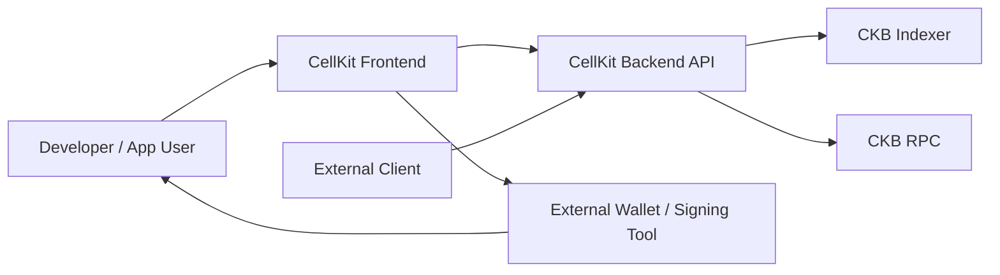
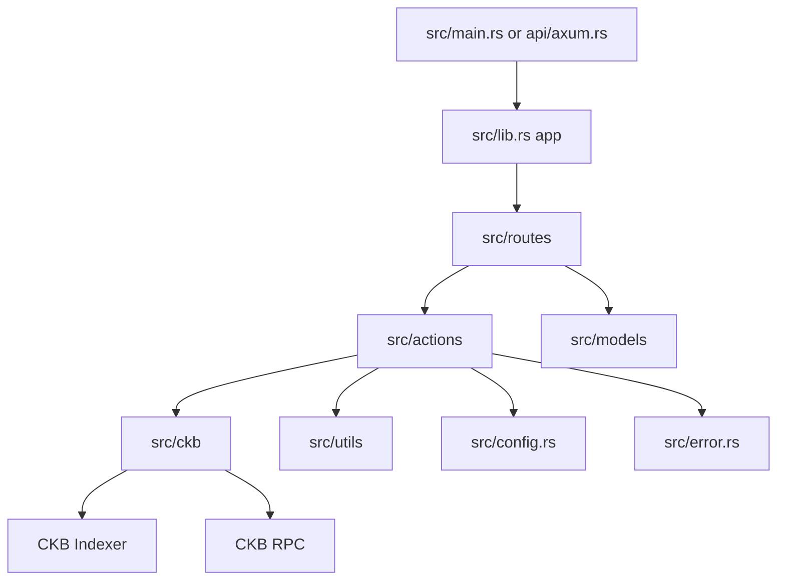
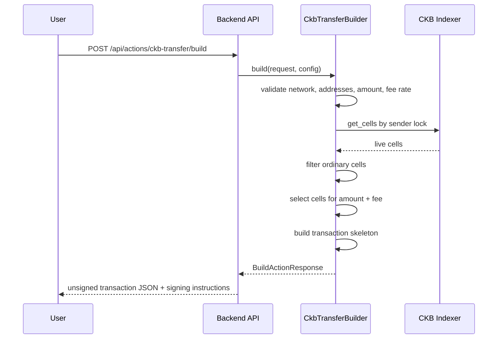
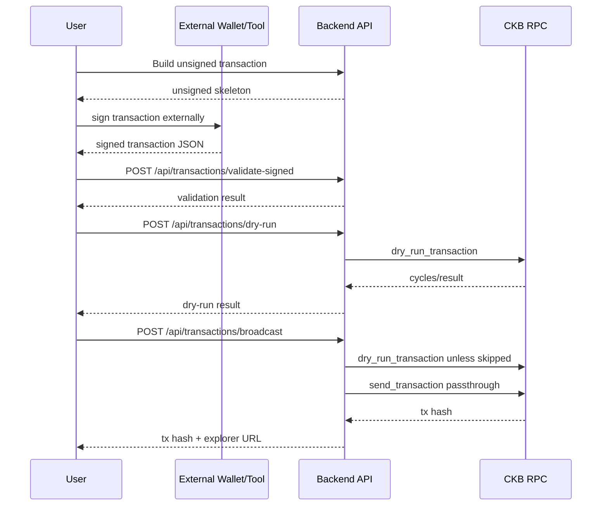

# CellKit Actions Backend Architecture

This document explains how the CellKit backend is structured and how transaction-action requests move through the system.

## Purpose

CellKit Actions Backend provides reusable CKB testnet transaction-action services. Its role is to handle chain-aware work that a frontend or application developer should not need to rebuild repeatedly:

- CKB address parsing
- Live cell lookup
- Capacity and fee calculation
- Transaction skeleton construction
- Transaction shape validation
- Signed transaction dry-run
- Signed transaction broadcast

CellKit does not sign transactions and does not manage private keys.

## System Context



The frontend and external clients call the backend. The backend calls CKB indexer for live cells and CKB RPC for dry-run/broadcast. Signing happens outside CellKit.

## Backend Module Map



Key folders:

- `src/routes` maps HTTP endpoints to handlers.
- `src/actions` contains action builders and signed transaction services.
- `src/ckb` contains CKB-specific integrations and conversion helpers.
- `src/models` defines API request/response shapes.
- `src/utils` contains pure helpers for amount conversion, fee estimation, hex handling, and validation.

## Unsigned CKB Transfer Build Flow



The builder uses real CKB testnet address parsing and live indexer data. It does not invent cells or fake chain state.

## Signed Transaction Flow



## Action Builder Pattern

Action builders implement a common trait:

```text
ActionBuilder<R>
  - action_id()
  - validate_request()
  - build()
  - response_summary()
```

This keeps action-specific request validation and build behavior isolated while keeping route handlers small.

Current real build support:

- `ckb.transfer`

Current scaffolded actions:

- `xudt.transfer`
- `cell.consolidate`
- `capacity.lock`
- `data_cell.create`

Scaffolded actions validate requests/configuration but return a clear not-implemented error for live selection/build behavior.

## Transaction Shape

The API uses a JSON transaction skeleton with camelCase fields:

```json
{
  "version": "0x0",
  "cellDeps": [],
  "headerDeps": [],
  "inputs": [],
  "outputs": [],
  "outputsData": [],
  "witnesses": []
}
```

This mirrors the shape expected by CKB JSON-RPC while keeping the payload inspectable by developers.

## External Dependencies

Runtime dependencies:

- CKB indexer endpoint for live-cell lookup
- CKB RPC endpoint for dry-run and broadcast
- Configured testnet secp256k1 cell dep for CKB transfer skeletons

Build/development dependencies:

- Rust
- Cargo
- CKB Rust crates
- Axum
- Tokio

## Security Boundaries

CellKit does not:

- Request private keys
- Store private keys
- Sign transactions
- Custody funds
- Manage accounts
- Broadcast to mainnet in this MVP

CellKit does:

- Build inspectable unsigned testnet payloads
- Require external signing
- Validate signed transaction shape before RPC calls
- Dry-run before broadcast by default
- Return clear errors for missing config and invalid payloads

## Verification Strategy

Automated checks:

```bash
cargo fmt -- --check
cargo clippy --all-targets --all-features -- -D warnings
cargo test
```

Manual testnet verification:

1. Build an unsigned CKB transfer.
2. Sign it externally.
3. Validate the signed transaction.
4. Dry-run the signed transaction.
5. Broadcast to CKB testnet.
6. Confirm a transaction hash and explorer URL are returned.
